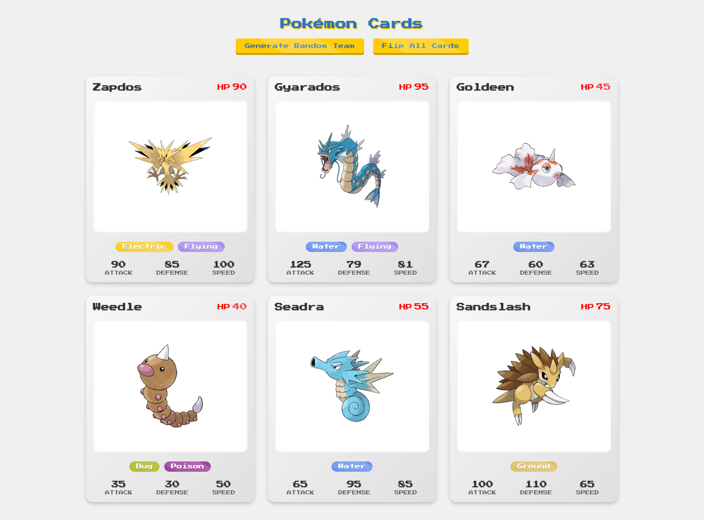

```markdown
# 🎴 Pokémon Card Team Generator

Welcome to the **Pokémon Card Team Generator** — a fun and interactive web app that generates a random team of Pokémon cards with detailed stats, type badges, animations, and a card-flip feature!

🌐 **Live Demo**: [Click here to try it out](https://tikesh-sahu-git.github.io/pokemon_card/)

## 🔥 Features

- 🔁 Generate a new random team of 6 Pokémon
- 🧠 Pokémon data powered by [PokeAPI](https://pokeapi.co/)
- 🎴 Flip cards to reveal stats, moves, and abilities
- 🌈 Type badges with unique colors
- ⚡ HP-based styling and attack stat animations
- 🎨 Smooth loading and transition animations
- 📱 Fully responsive layout

## 📸 Preview

  
> *(Add a screenshot of the project UI once ready)*

## 🚀 How It Works

1. On page load, a random team of 6 Pokémon is generated.
2. Each card includes:
   - Official artwork
   - HP, Attack, Defense, Speed stats
   - Type badges with colored backgrounds
   - Back side showing description, height, weight, abilities, and 4 moves
3. Click a card to flip it!
4. Use **"New Team"** and **"Flip All"** buttons to interact.

## 🛠️ Built With

- HTML5
- CSS3 (custom styles + animations)
- JavaScript (Vanilla JS)
- [PokeAPI](https://pokeapi.co/) for real-time Pokémon data

## 📁 Project Structure

```

pokemon\_card/
│
├── index.html           # Main HTML file
├── style.css            # Styles and animations
├── script.js            # Main JavaScript logic
├── assets/              # (Optional) Image or loader assets
└── README.md            # Project documentation

````

## 📦 Setup for Local Development

```bash
# Clone the repository
git clone https://github.com/tikesh-sahu-git/pokemon_card.git

# Open the index.html file directly in your browser
````

No build tools required — it’s a fully static project!

## 🤝 Contributing

Contributions are welcome! If you'd like to add features or improve design, feel free to fork the repo and submit a pull request.

## 📄 License

This project is open-source and free to use under the [MIT License](LICENSE).

---

### 👨‍💻 Developed by [Tikesh Sahu](https://github.com/tikesh-sahu-git)

Got feedback or ideas? Feel free to reach out or create an issue on GitHub.

```

---

Let me know if you'd like me to generate a screenshot mockup or write a `LICENSE` file for MIT!
```
